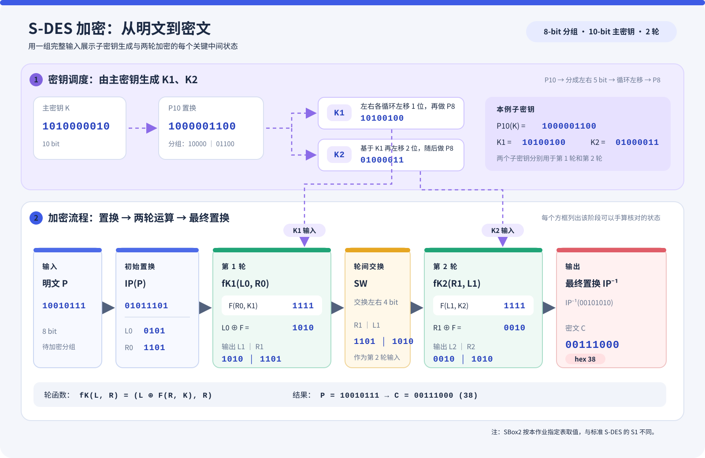

# S-DES 算法实现与五关实验

**《信息安全导论》作业 1：用 Python 实现课程指定的 S-DES，提供交互式加解密，并完成交叉测试、字符串与 TCP 通信、暴力破解、密钥碰撞分析。**

分组长度为 **8 bit**，主密钥为 **10 bit**，算法包含两轮运算。项目提供网页版、tkinter 桌面版和命令行；运行代码只使用 Python 标准库。

**阅读入口：** [作业要求](docs/作业要求.md) · [五关结果](#results) · [演示视频](#video) · [快速运行](#quickstart) · [目录与文档](#files)

## 这个实验要完成什么

实验需要把算法实现、使用方法和测试证据一起提交。五关之间的关系是：先实现一个分组的加解密，再与独立实现核对结果，将分组扩展到字符串和通信，最后通过穷举与碰撞统计理解密钥空间的局限。

| 关卡 | 作业要求 | 本项目的实现 | 结果入口 |
| --- | --- | --- | --- |
| **1 · 基本测试** | GUI 接收 8-bit 数据和 10-bit 密钥，支持加解密，输出 8-bit 结果 | 浏览器／桌面界面、子密钥显示、逐步跟踪 | [加密截图](截图与视频/第1关_加密.png)、[解密截图](截图与视频/第1关_解密.png)、[另一组输入](截图与视频/第1关_随机.png) |
| **2 · 交叉测试** | 不同组使用相同流程与 P/S 盒；同一明文和密钥得到同一密文，或能正确解密对方密文 | CSV 导入比对、项目内独立第二实现、外部程序互验脚本 | [200 行比对截图](截图与视频/第2关_交叉测试.png)、[CSV 数据](对方.csv) |
| **3 · 扩展功能** | 按 1 Byte 分组处理 ASCII 字符串，设计 UI 或扩展应用，例如 TCP Socket | ASCII／UTF-8 字节加解密、TCP 客户端与服务端、网页发送演示 | [双终端演示](截图与视频/第3关_服务端与客户端.png)、[网页通信演示](截图与视频/第3关_网页版.png) |
| **4 · 暴力破解** | 用已知明文—密文对穷举密钥，记录时间戳，用视频或动图展示耗时；可考虑多线程 | 1024 密钥完整搜索、线程基准；另附扩展密钥空间与多进程实验 | [10-bit 穷举](截图与视频/第4关_穷举.png)、[线程基准](截图与视频/第4关_性能基准.png)、[视频](截图与视频/第4关_破解演示.mp4) |
| **5 · 封闭测试** | 分析固定明文下，不同密钥是否可能产生相同密文 | 枚举 1024 个密钥 × 256 个明文，统计密文桶和候选密钥 | [全空间碰撞分析](截图与视频/第5关_封闭测试.png) |

课程原始要求、置换表、S 盒和提交清单见 [作业要求](docs/作业要求.md)。**本作业的 SBox2 有指定改动，应按作业给出的表实现**；使用公开 S-DES 样例前需要核对其 S 盒。

## 算法示例

下图使用第一关的明文 `10010111` 和主密钥 `1010000010`，展示子密钥 `K1`、`K2` 的生成，以及初始置换、两轮运算、左右交换和最终置换。密文为 `00111000`（十六进制 `38`）；图中数值与本项目逐步跟踪结果一致。



<a id="results"></a>
## 五关实验结果

以下数字来自仓库内的截图及已有实验记录。详细测试项见 [测试报告](docs/测试报告.md)，逐张说明和操作步骤见 [截图说明](docs/截图说明.md)，排版报告见 [Word 实验报告](docs/S-DES算法实现与五关测试报告.docx)。

### 第 1 关：一个分组的加密与解密

| 操作 | 输入数据（8 bit） | 密钥（10 bit） | 输出（8 bit） | 十六进制 | 证据 |
| --- | --- | --- | --- | --- | --- |
| 加密 | `10010111` | `1010000010` | `00111000` | `38` | [加密与中间状态](截图与视频/第1关_加密.png) |
| 解密 | `10010111`（作为密文） | `1010000010` | `10001100` | `8C` | [解密结果](截图与视频/第1关_解密.png) |
| 加密，另一组输入 | `00111111` | `0101001001` | `10101011` | `AB` | [随机输入与中间状态](截图与视频/第1关_随机.png) |

第一组密钥生成 `K1=10100100`、`K2=01000011`。加密截图展示密钥置换、初始置换、两轮运算、交换和最终置换的中间状态，可以逐步核对。

**解密截图使用了另一组密文输入。** 若要复现第一行的加密—解密回环，应将密文 `00111000` 填回输入框，使用同一密钥解密，结果应为 `10010111`。操作步骤见 [用户指南](docs/用户指南.md)。

### 第 2 关：不同实现之间核对结果

[交叉测试截图](截图与视频/第2关_交叉测试.png) 显示：随机种子 `20261008`、200 条测试向量，导入 CSV 后 **200/200 行一致**。每行使用 `pt,key,ct` 三列；仓库保存的文件可直接打开：[对方.csv](对方.csv)。

项目提供两种继续验证的方法：

- **项目内独立第二实现：** [gen_vectors.py](tests/gen_vectors.py) 使用独立的位串算法生成向量，可与 [core.py](sdes/core.py) 比对。
- **与其他组的程序互验：** [cross_test.py](tests/cross_test.py) 可加载外部实现，检查加密一致性和双方解密。对方源码未包含在本仓库，运行时需要 `--other` 指定目录，并满足脚本的接口约定。条件和历史记录见 [测试报告](docs/测试报告.md)。

网页版和桌面版共用同一算法内核，其结果一致属于界面一致性。CSV 截图记录了导入数据的一致性；判断是否完成了独立跨组验证，还需要结合 CSV 的来源和对应程序。

### 第 3 关：字符串加解密与 TCP 通信

字符串先按所选编码转为字节，再对每个字节进行一次 S-DES 运算，密文用十六进制表示。分组为 1 Byte，**无需补位**。ASCII 是课程要求，UTF-8 中文处理是附加功能。

| 演示 | 截图记录的结果 | 证据 |
| --- | --- | --- |
| 命令行客户端与服务端 | `This is a test`、`信息安全导论`、`A`、`Hello, S-DES! 1234567890` 共 **4/4 条还原成功** | [双终端截图](截图与视频/第3关_服务端与客户端.png) |
| 网页版发送到 TCP 服务端 | `This is a test` → `2268C72762C72762BD624EF8274E` → 还原原文；14 字节对应 14 个分组 | [网页与终端同框截图](截图与视频/第3关_网页版.png) |

通信流程：客户端本地加密 → 发送 `DEC <十六进制密文>` → 服务端解密 → 返回明文供客户端校验。**当前演示的返回方向传输明文，`KEY` 命令也会返回演示密钥**；协议及使用方式见 [用户指南](docs/用户指南.md) 和 [开发手册](docs/开发手册.md)。

### 第 4 关：穷举、耗时与并行实验

**课程要求对应的 10-bit 实验：** 已知 `P=10010111`、`C=00111000`，遍历全部 **1024** 个密钥，得到 3 个候选：

```text
0111001010    1010000010    1011001010
```

真实密钥 `1010000010` 在候选中，该次耗时 **6.00 ms**。见 [穷举截图](截图与视频/第4关_穷举.png)。这说明单个明文—密文对可能留下多个候选，需要用更多已知对继续筛选。

**多线程基准：** 同一任务重复 15 次取中位数，分块大小 64。见 [性能截图](截图与视频/第4关_性能基准.png) 与 [基准脚本](tests/bench_crack.py)。

| 配置 | 耗时中位数 | 候选集合 |
| --- | --- | --- |
| 单线程 | **4.885 ms** | 3 个 |
| 线程池 workers=1 | 5.395 ms | 与单线程一致 |
| 线程池 workers=2 | 5.663 ms | 与单线程一致 |
| 线程池 workers=4 | 6.228 ms | 与单线程一致 |
| 线程池 workers=8 | 5.990 ms | 与单线程一致 |
| 线程池 workers=16 | 6.236 ms | 与单线程一致 |

这次测量没有观察到线程提速。1024 个候选的任务很短，线程管理增加开销；常规带 GIL 的 CPython 也限制了纯 Python 计算的线程并行。课程将多线程作为可考虑的方案，实验结论应以实际测量为准。

**附加实验：扩展密钥空间。** 为呈现可观察的搜索进度，[longkey.py](sdes/longkey.py) 增加级联运算及更长主密钥。这属于附加实验，参数和结果单独列出：

| 实验 | 规模与完成范围 | 截图记录的结果 | 证据 |
| --- | --- | --- | --- |
| 22-bit，单线程，4 组已知对 | 完整遍历 4,194,304 / 4,194,304 | 17:37:35—17:38:43，约 **1 分 08 秒**；唯一候选 `1111101010001111111100` | [完整搜索截图](截图与视频/第4关_扩展密钥空间22bit.png) |
| 24-bit，8 进程，设定约 10 秒时限 | 已遍历 3,538,944 / 16,777,216，约 **21.1%** | 约 10.1 秒，352,034 候选/秒；与启动前单线程估测速率 76,660 相比约 **4.59 倍** | [部分搜索截图](截图与视频/第4关_并行8进程.png) |

24-bit 截图展示的是限时搜索，不能据此判断完整搜索耗时或密钥是否唯一；4.59 倍是这张截图中的速率比。视频单独收录在下面的 [演示视频](#video) 中。

### 第 5 关：不同密钥能否产生相同密文

**会。** 对任意固定明文，1024 个密钥映射到最多 256 种密文，必然存在不同密钥落入同一密文桶。全空间枚举的截图结果如下：

| 指标 | 结果 |
| --- | --- |
| 枚举范围 | 1024 个密钥 × 256 个明文 = **262,144** 个组合 |
| 每个明文的平均不同密文数 | **239** |
| 最大碰撞桶 | **12 个密钥** |
| 非空密文桶的平均候选数 | 约 **4.285 个** |
| 样例明文 `00000000` | 有 **224 种密文**对应多个密钥 |

查看 [全空间结果截图](截图与视频/第5关_封闭测试.png)，详细分布及统计口径见 [测试报告](docs/测试报告.md)。4.285 的分母是非空桶；若把全部 256 个密文值（含空桶）都计入，平均数为 `1024/256=4`。

这里分析的是**固定明文下的密钥碰撞**。某一对明文—密文可能只有一个候选，也可能有多个；一个已知对不保证唯一恢复密钥。不同密钥对所有明文都相同的“全局等价”需要另行比较完整映射，不能仅从子密钥对不同推断。

<a id="video"></a>
## 演示视频

### [点击查看或下载：第 4 关破解演示（MP4）](截图与视频/第4关_破解演示.mp4)

视频约 **1 分 05 秒**，展示 22-bit、单线程、4 组已知明文—密文对的搜索进度和完整结果。画面记录开始 `17:21:47`、结束 `17:22:46`，实际搜索 **59.0 秒**，完整遍历 **4,194,304** 个候选，真实密钥包含在 **6 个候选**中。它与上面 68 秒、唯一候选的截图属于不同轮次。

视频文件与截图一起保存在仓库的 [截图与视频目录](截图与视频)。点击文件链接即可定位；若 GitHub 未提供内嵌播放，可下载后使用本地播放器观看。

相关结果入口：[10-bit 穷举](截图与视频/第4关_穷举.png) · [线程基准](截图与视频/第4关_性能基准.png) · [22-bit 完整搜索](截图与视频/第4关_扩展密钥空间22bit.png) · [24-bit 八进程限时搜索](截图与视频/第4关_并行8进程.png)

<a id="quickstart"></a>
## 快速运行

### 1. 环境与网页界面

需要 **Python 3.10+** 和浏览器。代码无需 `pip install`；桌面版额外需要当前 Python 安装提供 `tkinter`。先获取仓库并进入包含 `sdes/`、`tests/`、`docs/` 的项目根目录，再执行：

```powershell
python -m sdes.webapp --open
```

默认地址为 <http://127.0.0.1:8000>。依次点击五关标签即可操作；“算法规格”页展示公式、置换表和 S 盒。按 `Ctrl+C` 关闭服务。如 8000 端口被占用，可运行 `python -m sdes.webapp --port 8080 --open`。

桌面版入口：

```powershell
python -m sdes.gui
```

各按钮、输入格式和异常提示见 [用户指南](docs/用户指南.md)。

### 2. TCP 演示：分别打开两个终端

终端 A，先启动服务端，默认地址 `127.0.0.1:50007`：

```powershell
python -m sdes.server
```

终端 B，启动四条消息的往返演示：

```powershell
python -m sdes.client
```

服务端保持运行时，也可在网页第 3 关点击“发送到 TCP 服务端”。

### 3. 复现实验与查看测试

以下命令可按需运行；性能数字会随设备、Python 版本和输入变化。本次文档整理未重新运行项目测试，已有运行记录见 [测试报告](docs/测试报告.md)。

| 目的 | 在项目根目录执行 |
| --- | --- |
| 四个测试模块的汇总入口 | `python -m tests.run_all` |
| 独立第二实现生成并核对 200 条 CSV | `python -m tests.gen_vectors -n 200 --check -o 交叉测试向量.csv` |
| 10-bit 穷举 | `python -m sdes.crack` |
| 单线程与多线程基准 | `python -m tests.bench_crack` |
| 全空间碰撞分析 | `python -m sdes.crack report` |
| 22-bit 扩展空间完整搜索 | `python -m sdes.longkey --bits 22 --interval 5` |
| 24-bit 八进程限时搜索 | `python -m sdes.longkey --bits 24 --workers 8 --max-seconds 10` |

与外部程序互验前，先准备对方源码，再指定其 `sdes` 包目录。此处路径是示例，需要替换为实际路径：

```powershell
python -m tests.cross_test --other ..\队友\SDES\sdes --full
```

接口适配要求、抽样／全空间选项及跳过项的解释见 [测试报告](docs/测试报告.md)。默认的 `_组2参考/SDES/sdes` 不在仓库中。

<a id="files"></a>
## 目录与文档

| 入口 | 内容 |
| --- | --- |
| [作业要求](docs/作业要求.md) | 原始任务、算法规格、五关验收内容、提交清单及原始截图 |
| [用户指南](docs/用户指南.md) | 环境准备、网页／桌面／CLI 操作、输入示例和 TCP 使用 |
| [开发手册](docs/开发手册.md) | 模块分工、核心函数、HTTP API、TCP 协议和扩展方法 |
| [测试报告](docs/测试报告.md) | 已有测试记录、各关结果、统计解释和复现条件 |
| [截图说明](docs/截图说明.md) | 12 张截图和视频的逐项链接、画面含义与操作步骤 |
| [Word 实验报告](docs/S-DES算法实现与五关测试报告.docx) | 可下载阅读的排版报告 |
| [截图与视频](截图与视频) | 五关结果原图、算法规格页及 MP4 |
| [CSV 测试向量](对方.csv) | 交叉测试中保存的 200 条 `pt,key,ct` 数据 |
| [sdes](sdes) | 核心算法、编码、破解、界面和 TCP 程序 |
| [tests](tests) | 自测代码、独立实现、外部互验和基准脚本 |

主要源码：[核心算法](sdes/core.py) · [字节编解码](sdes/codec.py) · [穷举与碰撞](sdes/crack.py) · [扩展空间](sdes/longkey.py) · [网页后端](sdes/webapp.py) · [网页前端](sdes/web) · [桌面界面](sdes/gui.py) · [TCP 服务端](sdes/server.py) · [TCP 客户端](sdes/client.py)
